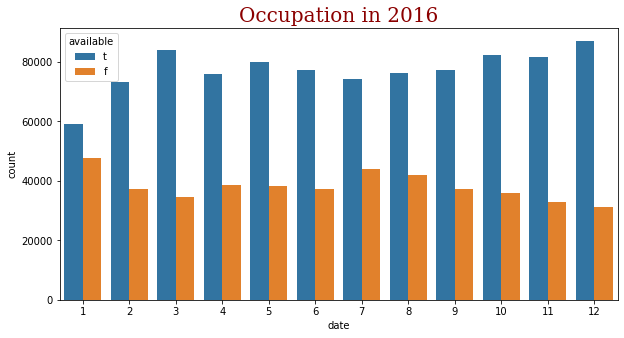
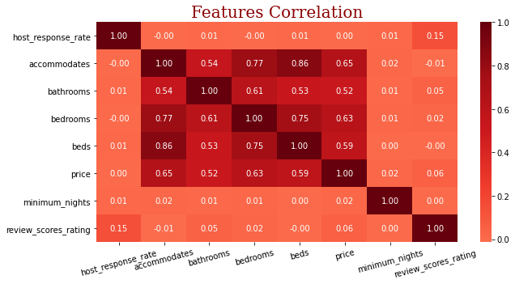
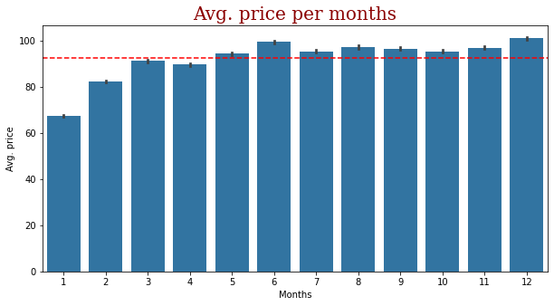

# Airbnb Seattle

This post is part of Udacity data science Nanodegree program. 

Since 2008, guests and hosts have used Airbnb to travel in a more unique, personalized way. this dataset describes the listing activity of homestays in Seattle, WA at 2016.

The following Airbnb activity is included in this Seattle dataset:

* **Listings**, including full descriptions and average review score
* **Reviews**, including unique id for each reviewer and detailed comments
* **Calendar**, including listing id and the price and availability for that day

The data set is sourced from Kaggle [here](https://www.kaggle.com/airbnb/seattle/data) and it looks at the Airbnb listings in Seattle in 2016.

------

I have to analyse the Airbnb Seattle dataset for 2016 following the CRISP-DM(Cross Industry Process for Data Mining) process as following.

* Business Understanding
* Data Understanding
* Prepare Data
* Data Modeling
* Evaluate the Results
* Deploy

------

I will ask some questions to help to understand and investigate the dataset as the following:

* What is the occupancy rate during 2016 at the level of months?
* What is the most features affect on the price?
* What is the average price per months?
* What is the AVg. host response rate?
* What is the most host response time?

------

#### 1) What is the occupancy rate during 2016 at the level of months?

Based on the graph compare the occupation rate (True, False) during 2016 for Seattle. we can notice the occupation rate change form month to month, we want to analysis the seasonality of occupation to help us to make decisions in months that have low occupancy and months that have high occupancy. we can notice from the graph that the occupation rate at level of months during 2016 is high in months March, October, November and December, so it is the seasonality months, it is normal to find this months as seasonality because the vacation of summer and spring. i recommend for the months that have low occupation to increase the ads and make more offers.

------

#### 2) What is the most features affect on the price?

In this question we tried to find what is the features that related to price, form this correlation matrix we can find that the price have a positive correlation with beds, bathrooms and accommodates.

------

#### 3) What is the average price per months?

Based on this graph we try to investigate the average of the price per months we can notice that the price increase in seasonality months that we talked up about it and it is normal i think Aribnb can control the price in seasonality months by searching more hosts and give him a new offers and that make stability in the prices specially in seasonality months.

------

#### 4) What is the AVg. host response rate?

In this question we use statistical measure not a graph to find the average of hosts response rate, after make out statistical tolls we found it’s about $96\%$ and it is a wonderful rate, i think we reach this wonderful rate because the hosts admire with the way that Airbnb treat them. 

------

#### 5) What is the most host response time?

.png)

Based on this graph we try to investigate the most host response time we can find with $70\%$ the respond with in one hour and it a wonderful rate 

To get a detailed view of the code and analysis, please refer to the link [here](https://github.com/mohamed-azzam/Seattle-Airbnb-Udacity-Project/blob/main/Seattle_Airbnb_Analysis.ipynb).